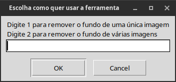

# removebg

Este é um sisteminha python que basicamente remove o background (fundo) das imagens poupando horas do seu precioso tempo.

## Instalação da ferramenta

- Clone o repositório pelo terminal usando o comando: ```git clone https://github.com/elizeubarbosaabreu/removebg```.

- Em seguida, navegue até o diretório, ative o ambiente virtual e instale as dependências:
~~~python
cd removebg
python3 -m venv env
source env/bin/activate
pip install -r requirements.txt
~~~

- Execute o app com o comando: ```python3 main.py```:



- Para usar via cli use: ```python3 caminho_da_imagem_com_fundo.jpg caminho_da_imagem_com_fundo_removido.png```

## Dicas

- A primeira vez que rodar o código vai demorar um pouco pois vai baixar um modelo de inteligência atificial 

- Utilize o pyinstaller para gerar um executável para o removebg. ```pyinstaller --noconsole --onefile main.py```

- No linux renomeie o executável ```main``` para algo como ```rmbg``` e salve em ```.local/bin``` e gerar um atalho usando o editor de menu alacarte apontando para o path ```.local/bin/rmbg```. Use um ícone de sua preferência.

- No Windows, dá para deixar o executável na área de trabalho, ou mesmo em um disposito portátil como um pendrive.

## Gostou então deixe uma star